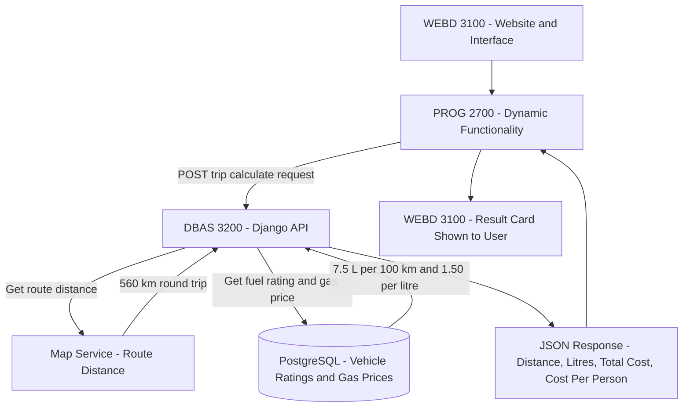

# FuelFare — Application Concept
**DBAS 3200 — Workshop 1 | Tobin | Fall 2026**

## 1. Application Name

**FuelFare** (working title)

## 2. Application Summary

FuelFare is a trip cost calculator that tells drivers what it will cost in gas to get from point A to point B, based on their specific vehicle and the current fuel prices where they live. A user enters a starting location and a destination, and FuelFare uses a map service to find the driving distance. The user selects their vehicle by year, make, model, and engine, and FuelFare calculates the fuel needed and the total cost of the trip. Registered users can save their vehicles and frequent trips, split costs between passengers, and track what they've spent on driving over time.

Most people guess at what a trip will cost, which makes it hard to budget, split gas money fairly with friends, or decide whether a trip is worth taking. This is especially true in rural Nova Scotia, where long drives are normal and gas is a major expense. FuelFare is built for students, commuters, and anyone planning a road trip. Data is central to the application: it relies on a catalogue of vehicle fuel consumption ratings (Natural Resources Canada publishes these as open data), gas prices organized by region, and route distances from a map service. In Nova Scotia, gas prices are regulated and set weekly for each geographic zone, so FuelFare stores prices by zone and uses the price for the user's area.

## 3. Intended Users

| User Type | What They Need |
|---|---|
| **Visitor** | Enter a start and destination, pick a vehicle, and get a quick trip cost estimate without an account. Check current gas prices by zone. |
| **Driver (Registered User)** | Save their own vehicles in a "garage," save frequent trips (such as home to school), split trip costs between passengers, and view their trip cost history. |
| **Administrator** | Maintain the vehicle catalogue, manage price zones and fuel types, and update gas prices weekly. |

## 4. Core Application Experience

**Core / primarily static pages (WEBD 3100):**
- **Home:** what FuelFare does, with a call to action to calculate a trip
- **How It Works:** explains the calculation (route distance × fuel consumption × gas price)
- **About the Data:** where the vehicle ratings, gas prices, and route distances come from
- **FAQ**
- **Contact**

**Data-driven experiences (DBAS 3200 + PROG 2700):**
- **Trip Calculator:** enter a start and destination, choose a vehicle and zone, and get the distance and cost
- **Vehicle Search & Details:** browse and filter vehicles and view their fuel ratings
- **Gas Prices by Zone:** current prices for each zone and fuel type
- **My Garage:** a driver's saved vehicles
- **My Trips:** saved trips and cost history
- **Admin Dashboard:** manage vehicles, zones, and weekly gas prices

## 5. Cross-Course Integration

| Course | Contribution to FuelFare |
|---|---|
| **WEBD 3100** | Designs the website's identity, layout, navigation, static pages, and the visual components for the calculator, results, garage, and trip history. |
| **DBAS 3200** | Develops the Django API and PostgreSQL database that store vehicles, zones, gas prices, users, garages, and trips. Connects to a map service to get route distances and performs the trip cost calculation. |
| **PROG 2700** | Builds the dynamic client-side functionality: the start and destination inputs, the step-by-step vehicle dropdowns, sending trip details to the API, and displaying results without page reloads. |

**Following one feature across the courses: Calculate Trip Cost from Point A to Point B**
- **WEBD 3100** designs the calculator form (start, destination, vehicle, passengers) and the result card showing distance, litres used, total cost, and cost per person.
- **PROG 2700** loads the year → make → model → engine dropdowns from the API, sends the start, destination, vehicle, zone, and passenger count, and displays the returned result instantly.
- **DBAS 3200** provides the calculation endpoint. It gets the driving distance between the two locations from a map service, retrieves the vehicle's fuel rating and the zone's current gas price from PostgreSQL, calculates the cost, and returns the result as JSON.

## 6. Initial Functional Requirements

1. The application shall allow users to enter a starting location and a destination and get the driving distance between them.
2. The application shall allow visitors to search for a vehicle by year, make, model, and engine.
3. The application shall allow visitors to view current gas prices by zone and fuel type.
4. The application shall allow users to calculate the fuel cost of a trip from the route distance, their vehicle, and their zone's gas price.
5. The application shall allow users to calculate a round trip and split the cost between passengers.
6. The application shall allow registered drivers to add, update, and remove vehicles in their garage.
7. The application shall allow registered drivers to save, view, update, and delete trips.
8. The application shall allow administrators to manage the vehicle catalogue and update gas prices for each zone.

## 7. Initial Data Needs

- **Vehicles:** year, make, model, engine size, cylinders, transmission, fuel type, and city/highway/combined fuel consumption (L/100 km)
- **Fuel Types:** regular, mid-grade, premium, diesel
- **Price Zones:** the regions gas prices apply to
- **Gas Prices:** the price for each zone and fuel type, and the week it applies to
- **Users / Drivers:** account information
- **Garage Vehicles:** a driver's own vehicles, linked to the catalogue, with an optional nickname
- **Trips:** start location, destination, route distance, vehicle used, zone, round trip or not, number of passengers, calculated cost, and date

## 8. Initial API Capabilities

1. **Calculate trip cost:** accept a start, destination, vehicle, zone, and passengers; get the route distance from a map service; and return distance, litres used, total cost, and cost per person
2. **Search vehicles:** filter the catalogue by year, make, model, and engine
3. **Get current gas prices:** return prices for a zone, or for all zones
4. **Manage trips:** create, read, update, and delete a driver's saved trips
5. **Manage garage:** create, read, update, and delete a driver's vehicles
6. **Manage catalogue and prices (admin):** update vehicles and gas prices for a zone

## 9. Project Scope

| Must Have | Could Have |
|---|---|
| Point A to point B distance from a map service | Interactive map showing the route line |
| Manual distance entry as a backup | Saved places (Home, School, Work) |
| Vehicle search (year/make/model/engine) | Multi-stop road trips |
| Trip cost calculator | User-reported gas station prices |
| Gas prices by zone | Fuel logging to calculate a car's real-world fuel economy |
| Round trip and passenger cost split | Comparing two vehicles for the same trip |
| My Garage and saved trips | Monthly fuel spending statistics |
| Admin management of vehicles and prices | Gas price history charts |

Getting the route distance is a Must Have because it is central to the application. Displaying the route on an interactive map is a Could Have because it is mainly visual and the cost calculation works without it. Manual distance entry is kept as a backup in case the map service is unavailable.

## 10. Conceptual Architecture



**Example data flow:** a user requests a trip from Port Hawkesbury, NS to Halifax, NS. The Django API gets the route distance from the map service (560 km round trip), looks up the vehicle's fuel rating (7.5 L/100 km) and the zone's gas price ($1.50/L) in PostgreSQL, and returns JSON: 42 L used, $63.00 total, $31.50 per person for 2 passengers.

## 11. GitHub Repository

**Repository:** https://github.com/tobinchisholm-svg/FuelFare

**Starting structure:**
```
FuelFare/
├── README.md
├── docs/
│   ├── concept.md
│   └── architecture/
└── src/
```
